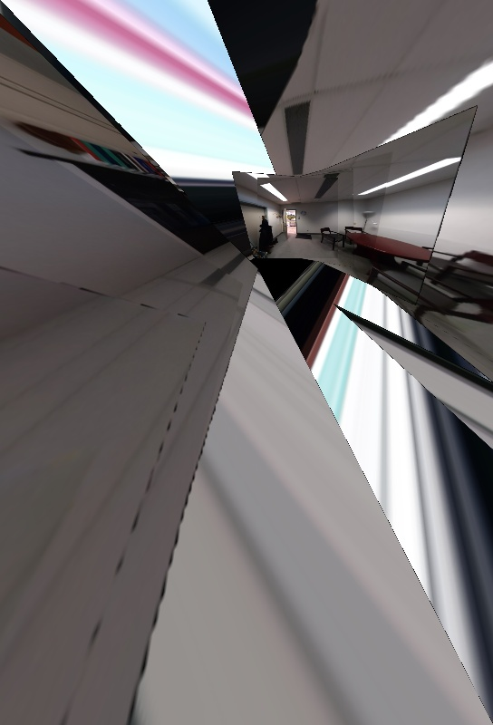
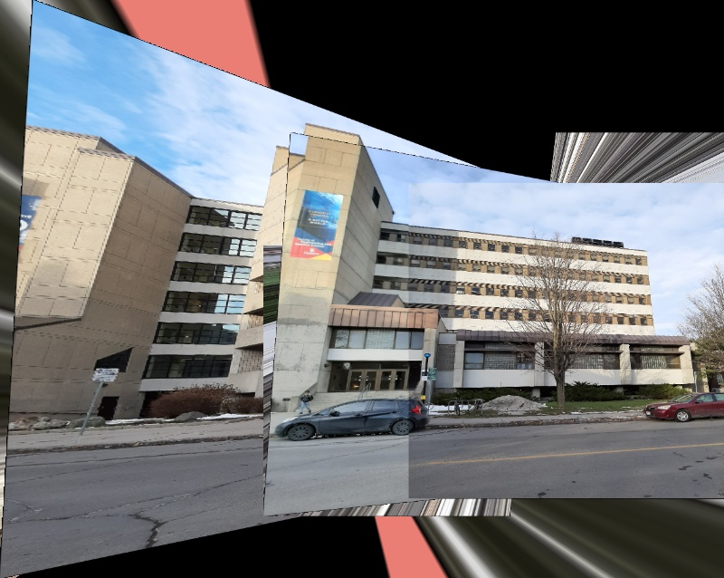
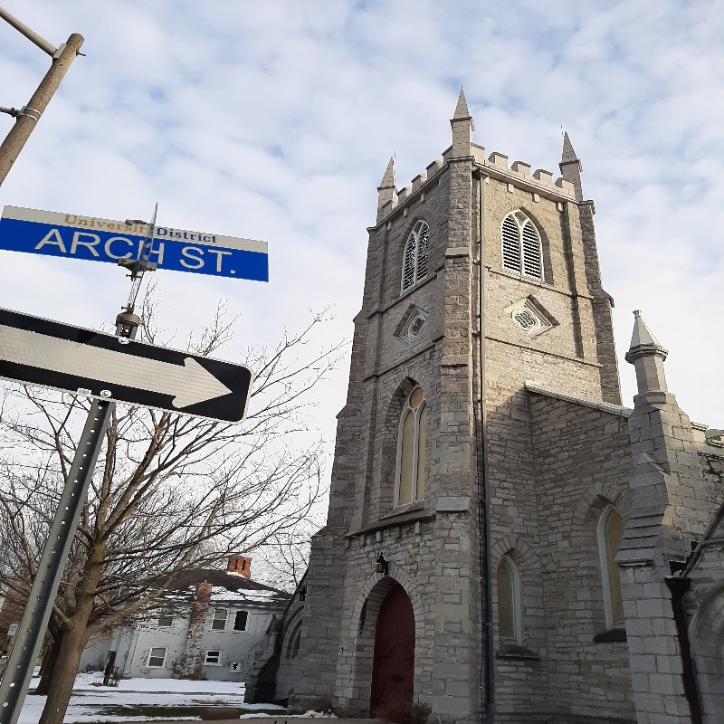
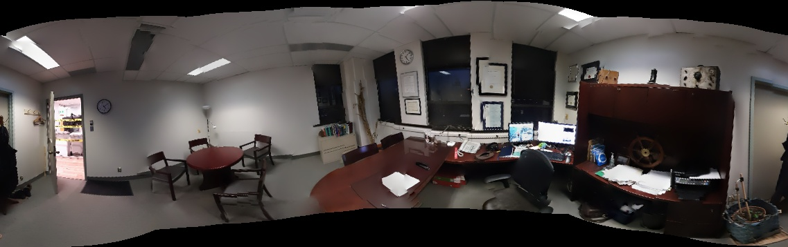
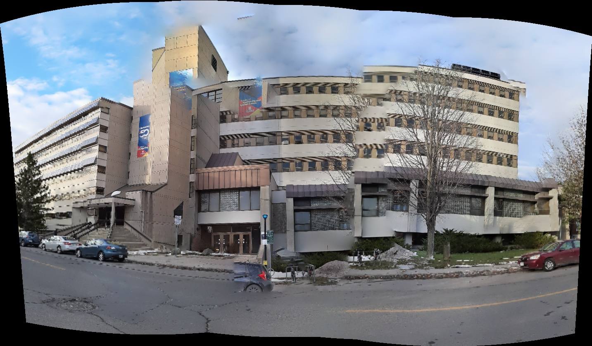
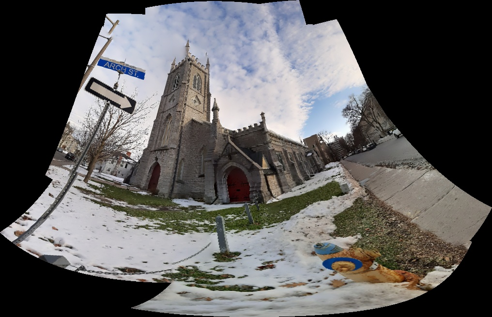
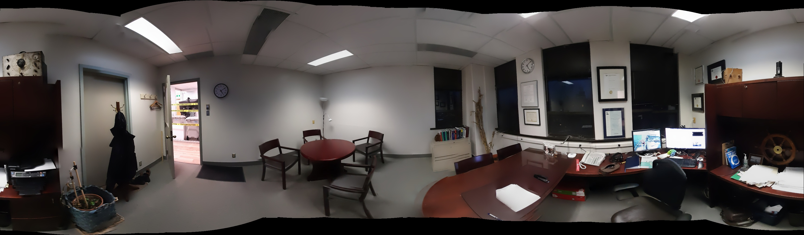
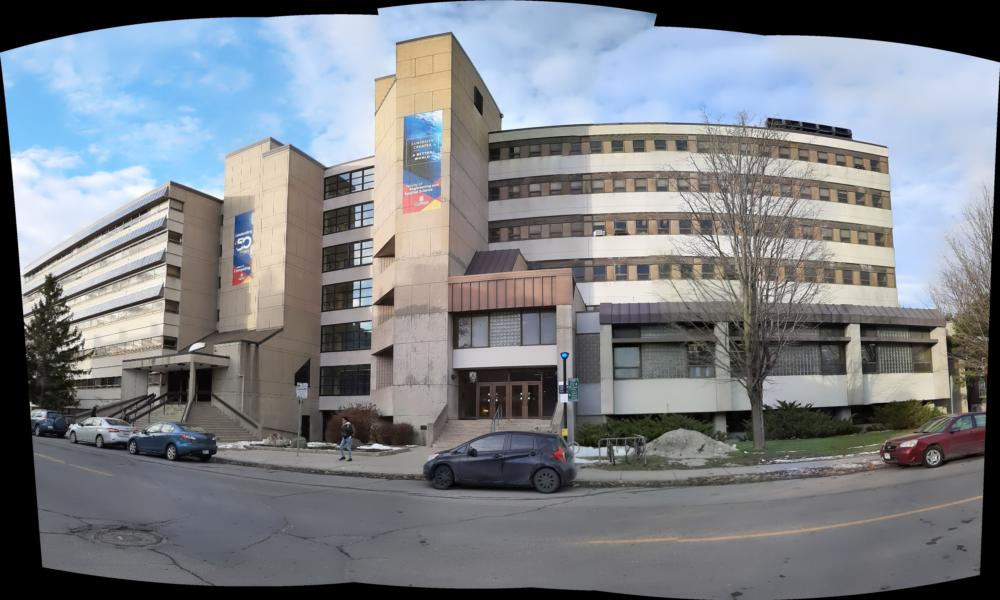
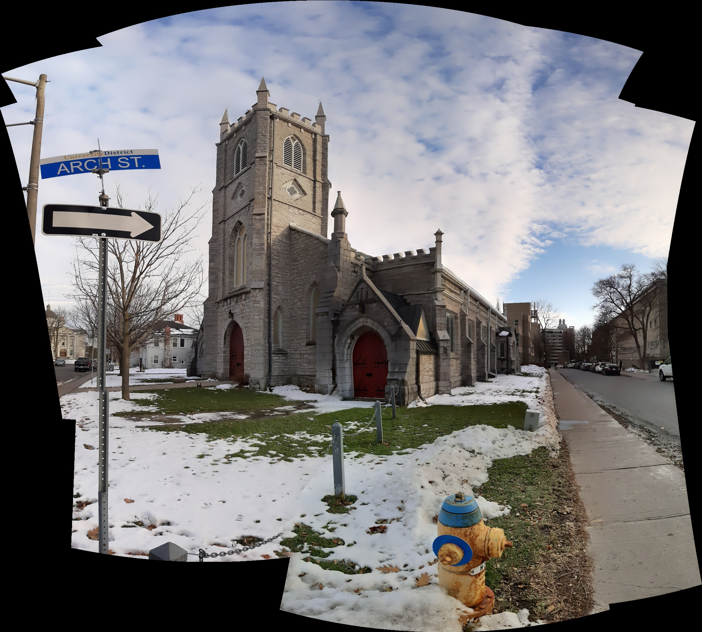

<h1 align="center"> Panorama Stitching Pipeline </h1>

<p align="center">
  
  
  
  
  
  
  
  
</p>

---

## 🧰 Tools & Technologies

| Tool / Technology | Role in Project |
|---|---|
|  **C++** | Core language for all three stitching implementations |
|  **OpenCV 4** | Computer vision library — SIFT, FLANN, RANSAC, warping, blending |
|  **Python** | Notebook scripting and Colab orchestration |
|  **Jupyter Notebook** | Interactive pipeline execution via `PanaromaStitching.ipynb` |
|  **Google Colab** | Cloud execution environment with GPU/CPU runtime |
|  **Google Drive** | Dataset input and panorama output storage |
|  **GCC / G++** | C++ compiler used to build stitchers inside Colab |
|  **pkg-config** | Resolves OpenCV linker flags during compilation |

---


## 📌 Overview

This repository explores and implements various approaches to **Image Stitching** and **Panorama Generation** using C++ and OpenCV. The goal is to geometrically align and seamlessly blend a sequence of overlapping photographs into a single extreme-wide-angle canvas.

The project explores stitching algorithms across **three different architectural approaches**, scaling from a completely custom pairwise homography engine, up to utilizing advanced multi-band spherical blending pipelines.

---

## 🚀 The Three Approaches

### 1. Basic Stitcher (Primary Method)
> **Source:** [`basic_stitcher.cpp`](basic_stitcher.cpp)

This is the main focal point of the repository. It implements a completely custom, hierarchical "tournament-style" stitching engine from scratch. Instead of relying on pre-built pipeline black-boxes, this method explicitly defines the math and logic for aligning images.

* **Feature Extraction:** Identifies 500 dominant keypoints per image using the SIFT (Scale-Invariant Feature Transform) algorithm.
* **Feature Matching:** Uses the FLANN (Fast Library for Approximate Nearest Neighbors) matcher to quickly cross-reference descriptors between images.
* **Connectivity Matrix:** Calculates an N x N Inlier Matrix by validating RANSAC homographies to determine which images overlap the most.
* **Hierarchical Warping:** Greedily pairs images with the highest overlap, warps one perspective space onto the other (`cv::warpPerspective`), masks the boundaries, and repeats until a single canvas remains.

### 2. Advanced Stitcher (Low-Level Detail API)
> **Source:** [`advanced_stitcher.cpp`](advanced_stitcher.cpp)

This approach leverages OpenCV's lower-level `cv::detail` stitching components to construct a professional-grade panoramic pipeline piece by piece.
* **Camera Estimation:** Utilizes Bundle Adjustment to solve camera intrinsic and extrinsic focal/rotation matrices.
* **Spherical Warping:** Casts images onto a spherical projection to prevent extreme edge stretching found in planar homography.
* **Seam Finding:** Employs Voronoi seam-finding logic to slice image overlaps exactly where visual differences are minimized.
* **Multi-Band Blending:** Uses Laplacian pyramids to smoothly merge image extremities without creating blur or ghosting artifacts.

### 3. OpenCV Native Stitcher
> **Source:** [`opencv_stitcher.cpp`](opencv_stitcher.cpp)

A reference implementation using OpenCV's built-in, abstract `cv::Stitcher::create(Stitcher::PANORAMA)` class. It acts as a benchmark to compare our custom code against fully optimized, production-ready library standards.

---

## 📸 Results Gallery

Below are the rendered generated panoramas mapped from the individual dataset frames.

### Basic Stitcher Output (Custom Hierarchical Pipeline)
*Notice the planar homography perspective effects.*

**Dataset 1:**
<p align="center">  </p>

**Dataset 2:**
<p align="center">  </p>

**Dataset 3:**
<p align="center">  </p>

---

### Advanced Stitcher Output (Spherical Warping & Multi-Band Blending)
*Notice the cleaner seams and the curved spherical warping to retain proportions.*

**Dataset 1:**
<p align="center">  </p>

**Dataset 2:**
<p align="center">  </p>

**Dataset 3:**
<p align="center">  </p>

---

### OpenCV Core Stitcher Benchmark

**Dataset 1:**
<p align="center">  </p>

**Dataset 2:**
<p align="center">  </p>

**Dataset 3:**
<p align="center">  </p>

---

## 🛠 Compilation and Usage in Google Colab

This project is configured to run efficiently inside Google Colab, leveraging Google Drive for data storage. You can find the full executable pipeline in the provided `PanaromaStitching.ipynb` notebook.

### 1. Setup Environment
First, mount your Google Drive to access the dataset and store the output panoramas. Then, update the package list and install the OpenCV development libraries.
```python
# In a Colab cell
from google.colab import drive
drive.mount('/content/drive')

!sudo apt-get update
!sudo apt-get install libopencv-dev
```

### 2. Prepare Output Directory
Create the destination folder in your Drive to hold the generated panoramic images:
```bash
!mkdir -p "/content/drive/MyDrive/MachineVision/Output"
```

### 3. Compilation
You can compile any of the stitchers directly inside Colab using `g++` and `pkg-config`:

```bash
# Compile the Advanced Stitcher as an example
!g++ advanced_stitcher.cpp -o app `pkg-config --cflags --libs opencv4`

# Alternatively, compile the Basic Stitcher or OpenCV Stitcher
# !g++ basic_stitcher.cpp -o app `pkg-config --cflags --libs opencv4`
# !g++ opencv_stitcher.cpp -o app `pkg-config --cflags --libs opencv4`
```

### 4. Running the App
Execute the compiled binary (`app`), passing the path to the input image folder on your Drive and specifying the output filename.

```bash
# Example: Stitching the 'office2' dataset
!./app "/content/drive/MyDrive/MachineVision/Data/office2" "/content/drive/MyDrive/MachineVision/Output/panorama_advanced_1.jpg"
```
